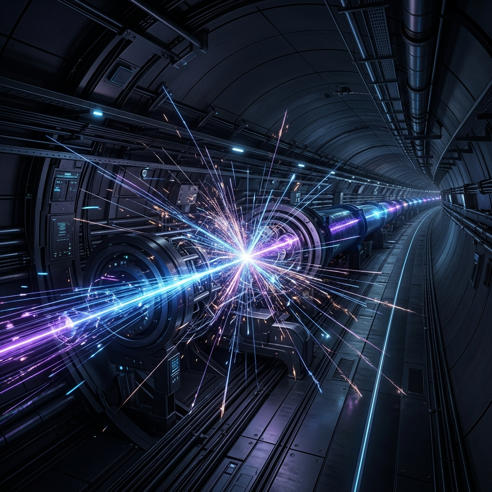

# 🌌 Awesome CERN Engineering

*İnsanlığın şimdiye kadar inşa ettiği en karmaşık makine olan Büyük Hadron Çarpıştırıcısı (LHC) ve CERN ekosistemindeki mühendislik harikalarını keşfetmek için özenle derlenmiş, yüksek yoğunluklu teknik bir kürasyon.*

---

Bu depo, CERN'ü sadece bir fizik laboratuvarı olarak değil; **Elektronik, Haberleşme, Kontrol Sistemleri, Veri İşleme ve Yazılım Mimarisi** odağında dünyadaki en büyük ve en kompleks mühendislik harikalarından biri olarak ele alan bir derin dalış içerir.

> 💡 **Tarihsel Bir Kesişim:** CERN, 29 Eylül 1954'te resmen kurulmuştur. Evrenin sırlarını çözmeye adanmış bu devasa laboratuvarın kuruluşundan yaklaşık bir yıl sonra, 18 Nisan 1955'te modern fiziğin babası **Albert Einstein** vefat etmiştir. İnsanlığın bilgi arayışındaki bayrak devri, zamanın böyle ince bir çizgisinde gerçekleşmiştir.

---

## 🗺️ İçerik Haritası

1.  [Hızlandırıcı Zinciri & Radyo Frekans (RF) Sistemleri](#1-hızlandırıcı-zinciri--radyo-frekans-rf-sistemleri)
2.  [Kriyojenik ve Süperiletken Mıknatıslar](#2-kriyojenik-ve-süperiletken-mıknatıslar)
3.  [Veri Toplama (DAQ) ve Trigger Sistemleri](#3-veri-toplama-daq-ve-trigger-sistemleri)
4.  [Kontrol ve Güvenlik Sistemleri (Security by Design)](#4-kontrol-ve-güvenlik-sistemleri-security-by-design)
5.  [WLCG: Küresel Dağıtık Hesaplama](#5-wlcg-küresel-dağıtık-hesaplama)
6.  [Açık Kaynak Teknoloji ve Araçlar](#6-açık-kaynak-teknoloji-ve-araçlar)
7.  [Egzotik ve Antin Kuntin Simülasyonlar (APL)](#7-egzotik-ve-antin-kuntin-simülasyonlar)
8.  [Gelişmiş Python Simülasyonları (Fizik Motoru)](#8-gelişmiş-python-simülasyonları)
9.  [Karanlık Madde (Dark Matter) Araştırmaları](#9-karanlık-madde-dark-matter-araştırmaları)

---

## 🚀 1. Hızlandırıcı Zinciri & Radyo Frekans (RF) Sistemleri

LHC, tek bir makineden ziyade, parçacıkları adım adım ışık hızına ($0.999999991c$) ulaştıran devasa bir sistemler zinciridir.

*   **LINAC 4:** Hidrojen atomlarını protonlara dönüştürüp $160$ MeV enerjiye ulaştıran, başlangıç noktası olan doğrusal hızlandırıcı.
*   **PS (Proton Synchrotron) & SPS (Super Proton Synchrotron):** Proton katarını trilyon elektronvolt (TeV) seviyelerine hazırlayan devasa ara duraklar.
*   **RF Boşlukları (RF Cavities):** Parçacık demetlerini (beam) her turda "itmeyi" ve paketler halinde tutmayı sağlayan, senkronizasyonu milisaniye hatta mikrosaniye hassasiyetinde olan yüksek güçlü elektromanyetik boşluklar.

## ❄️ 2. Kriyojenik ve Süperiletken Mıknatıslar

LHC'nin yeraltındaki 27 kilometrelik tünelinde, dirençsiz (süperiletken) bir ortam sağlamak hayati önem taşır. Evrenin en soğuk yerlerinden biri İsviçre'nin altındadır.

*   **1.9 Kelvin Sıcaklık:** Süperiletken mıknatısların verimli çalışabilmesi için tüm sistem **-271.3 °C**'ye soğutulur. Bu, derin uzaydan ($2.7$ Kelvin) bile daha soğuktur!
*   **Sıvı Helyum Altyapısı:** Tonlarca süperakışkan sıvı helyumun termodinamik bir şaheser şeklinde devridaimi.
*   **Dipol Mıknatıslar:** İçinden $11,850$ Amper akım geçerek $8.3$ Tesla gücünde inanılmaz bir manyetik alan yaratan ve ışık hızına yakın parçacıkları yörüngede tutmayı başaran dev helezonik donanımlar.

## 📊 3. Veri Toplama (DAQ) ve Trigger Sistemleri

LHC dedektörlerinde saniyede yaklaşık **40 milyon** çarpışma gerçekleşir. Bu, saniyede Petabaytlarca veri demektir ve klasik veri tabanı mimarilerinin sınırlarını darmadağın eder.

*   **Trigger (Tetikleyici) Sistemler:**
    *   **Level 1 (L1):** Saf donanım tabanlı (Custom FPGA & ASIC tasarımları). Saniyenin binde biri (mikrosaniye) gibi bir sürede kaba veriyi süzerek "en ilginç" olanları yakalar.
    *   **High Level Trigger (HLT):** Yazılım ve işlemci tabanlı devasa bir bilgisayar çiftliğinde (farm) çalışan sinir ağları ve makine öğrenimi algoritmalarıyla ikinci seviye eleme işlemi.
*   **Edge Computing & On-Premise AI:** Daha verinin kalıcı depolamaya geçmeden, dedektör seviyesinde anlık analiz edilip gereksiz kısımlarının "drop" edilmesi.

## 🛡️ 4. Kontrol ve Güvenlik Sistemleri (Security by Design)

Dikkate değer bir enerji yoğunluğuna sahip bu laboratuvarda, sadece tek bir mıknatısın enerjisinin istenmeyen bir şekilde boşalması (Quench) tüm sistemi eritebilecek bir faciaya yol açabilir. "Security by Design" bir lüks değil, şarttır.

*   **Interlock Mimari:** Sıkıntılı bir radyasyon artışı, sıcaklık sapması veya güç dengesizliği durumunda hüzmeyi (beam) mikrosaniyeler içinde tahliye (dump) bloğuna yönlendiren sinir sistemi.
*   **Endüstriyel Kontrol:** **SCADA** ve **PLC**'ler yardımıyla, **WinCC OA** gibi dev endüstriyel platformlar üzerinden on binlerce sensörün 7/24 eşzamanlı izlenmesi.
*   **Radyasyon Dirençli Elektronik (Rad-Hard):** Dedektörün merkezinde donanımların radyasyondan etkilenmemesi (Single-Event Upset gibi hataların önlenmesi) için özel üretilen çipler ve hata kodlama (ECC) teknikleri.

## 🌐 5. WLCG: Küresel Dağıtık Hesaplama

CERN'de toplanan yüksek hacimli veriler dünyadaki tek bir işlem merkezinde analiz edilemez.

*   **Grid Computing:** *Worldwide LHC Computing Grid* (WLCG), 42 ülkeden 170'ten fazla veri merkezinin fiber optik ağlarla birleştirilmesiyle çalışan sanal bir süper-bilgisayardır.
*   **Infrastructure as Code & Otomasyon:** Yıllık **$25$ PB** üzerinde verinin (Tier 0'dan Tier 1 ve Tier 2 merkezlerine) otomatik olarak dağıtılması ve analiz kuyruklarının (Job Scheduler) yönetimi.
*   **Ara Katmanlar (Middleware):** Dünyanın farklı yerlerindeki heterojen sunucu sistemlerini bir arada orkestre etmek.

## 🛠️ 6. Açık Kaynak Teknoloji ve Araçlar

CERN mühendisliği yazılımdan donanıma birçok alanda devrimsel teknolojilere ev sahipliği yapar.

| Teknoloji / Araç | Kullanım Amacı | Teknik Rolü |
| :--- | :--- | :--- |
| **ROOT** | Büyük veri analizi & istatistik | C++ tabanlı nesne yönelimli veri analiz çerçevesi, dev istatistikler ve histogramlar çizer. |
| **Geant4** | Parçacık simülasyonu | C++ aracı, parçacıkların maddeler arasından geçerken nasıl davrandığını Monte Carlo simülasyonu ile hesaplar. |
| **KiCad** | PCB Tasarımı | CERN mühendislerinin açık kaynağa kazandırdığı, rad-hard devrelerin tasarlanmasında da desteklenen PCB dizayn platformu. |
| **VHDL & Verilog** | FPGA Geliştirme | Ultra-hızlı donanım tabanlı veri yollandırma ve mantıksal tetikleyicilerin programlanması. |
| **White Rabbit** | Alt-nanosaniye senkronizasyon | Binlerce dğüm arası ethernet üzerinden saniyenin milyarda biri hassasiyetinde zaman senkronizasyonu protokolü (PTP uzantısı). |

---

## 👽 7. Egzotik ve Antin Kuntin Simülasyonlar

Bu bölüm, CERN'ün uçak fiziğine yakışır şekilde, alışılmadık programlama dillerini içerir.
*   **APL Simülasyonu:** Lorentz faktörü hesaplamalarını içeren, matematiksel semboller ve egzotik kodlar barındıran [APL kodu](file:///g:/Diğer bilgisayarlar/Dizüstü Bilgisayarım/github repolarım/awesome-cern-engineering/07_Exotic_Simulations/lorentz_factor.apl).

## 🧮 8. Gelişmiş Python Simülasyonları

CERN mühendisliğini daha derinden hissetmek için geliştirilen matematiksel modeller.
*   **Collision Kinematics:** İki protonun çarpışmasından ortaya çıkan dört-vektör momentumlarını hesaplayan profesyonel [Python](file:///g:/Diğer bilgisayarlar/Dizüstü Bilgisayarım/github repolarım/awesome-cern-engineering/08_Advanced_Simulations/collision_kinematics.py) ve [APL](file:///g:/Diğer bilgisayarlar/Dizüstü Bilgisayarım/github repolarım/awesome-cern-engineering/08_Advanced_Simulations/collision_kinematics.apl) versiyonları.

---

## 🌌 9. Karanlık Madde (Dark Matter) Araştırmaları

Evrenin büyük bir kısmını kaplayan ancak görünmeyen bu gizemli maddeyi bulmak için CERN'de uç nokta mühendislik teknikleri uygulanır.

*   **Missing Energy Signature:** Görünür tüm parçacıkların toplam momentumunun sıfır çıkmamasından hareketle, görünmeyen parçacıkların izini sürme.
*   **Aksiyon Arayışları (CAST):** Güneş'ten gelen aksiyonları 9 Tesla'lık mıknatıslarla X-ışınına dönüştüren dev teleskop sistemleri.
*   **Hassas Zamanlama:** 30 pikosaniye (saniyenin trilyonda otuzu) çözünürlüğe sahip özel silikon dedektörlerin inşası.

---

## 📚 Kaynaklar ve İleri Okuma

*   [CERN Engineering Design Process](https://edms.cern.ch/)
*   [LHC Design Report](https://ab-div.web.cern.ch/ab-div/Publications/LHC-DesignReport.html)
*   [CERN Open Data Portal](https://opendata.cern.ch/)
*   [White Rabbit Projesi](https://white-rabbit.web.cern.ch/)
*   [The ROOT Data Analysis Framework](https://root.cern/)

---

> **Mühendislik Perspektifi:** Bu depo, sadece CERN'de fiziksel olarak ne inşa edildiğini anlatmak değil; oradaki uç nokta mühendislik disiplinini, arıza toleransını (fault-tolerance), dağıtık veri işlemeyi ve donanım zorluklarını kendi teknik projelerimize (gömülü sistemler, robotik, AI, devops vb.) nasıl taşıyabileceğimizi anlamak için bir manifesto niteliğindedir.

---

## 🛸 Mizah ve Şehir Efsaneleri

CERN, barındırdığı devasa enerji ve bilinmezlikler nedeniyle pek çok ilginç geyiğe de konu olmuştur. Bunlardan en popüler olanı şöyledir:

> "Bir gün uzaylılar dünyayı ziyarete gelmişler. Tam iniş yapacaklarken yeraltındaki devasa CERN tesislerini, 27 kilometrelik tünelleri, süperiletken mıknatısları ve atomları parçalayan o muazzam mühendisliği görmüşler. Şöyle bir durup birbirlerine bakmışlar ve demişler ki: **'Bunu yapanlar bize neler yapmaz? En iyisi biz hiç bulaşmadan geri dönelim.'** Ve geldikleri gibi sessizce galaksilerine geri gitmişler..."

---

---

### 🤝 Katkıda Bulunma
Eğer bir "Mühendislik" veya "Fizik" meraklısıysanız ve CERN'deki sistem mimarileri, veri toplama metodolojileri, kontrol ağları hakkında elinizde teknik bir makale (paper), donanım tasarımı veya açık kaynak bir bilgi varsa, lütfen bir **Pull Request** açarak kataloğumuzu genişletin!
