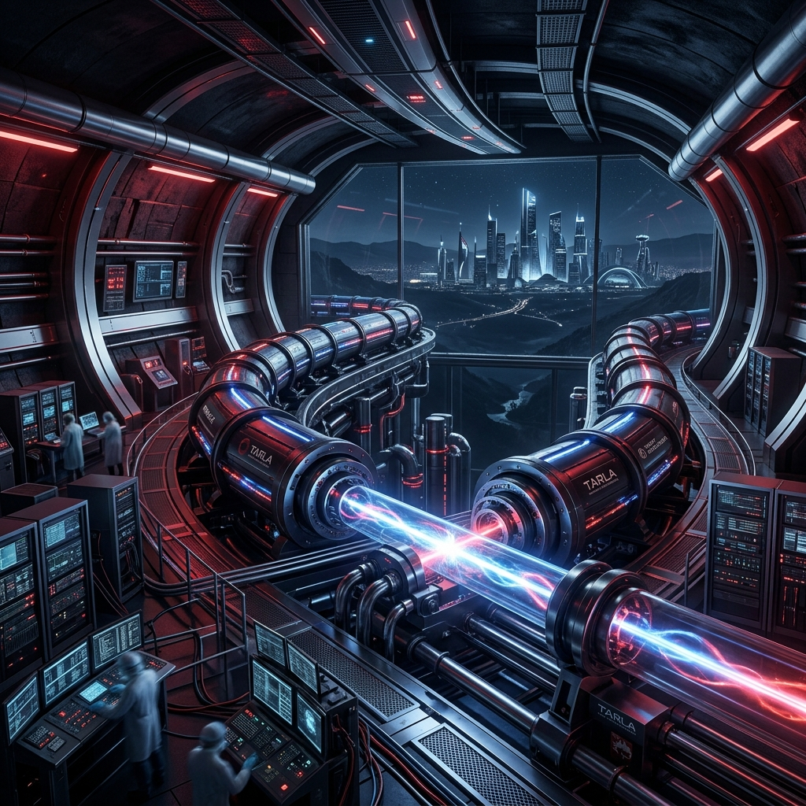

# 🇹🇷 Türkiye'nin Hızlandırıcı Teknolojileri ve Gelecek Vizyonu

**CERN Ortak Üyeliğinden Ulusal Süperiletken Hızlandırıcı Tesisi TARLA'ya: Türkiye'nin parçacık fiziği ve hızlandırıcı mühendisliğindeki yükselişi.**

---

## 🏛️ Kurumsal Temeller ve CERN Bağlantısı

Türkiye, parçacık fiziği arenasındaki yerini fantezi düzeyinde değil, somut iş birlikleri ve kurumsal üyeliklerle sağlamlaştırmıştır:

-   **CERN Ortak Üyeliği (Associate Member):** Türkiye, 2015 yılından bu yana CERN'ün ortak üyesi olup; ATLAS, CMS ve ALICE gibi devasa deneylerde Türk bilim insanları ve mühendisleri aktif olarak veri analitiği, donanım tasarımı ve simülasyon süreçlerinde rol almaktadır.
-   **TENMAK (Türkiye Enerji, Nükleer ve Maden Araştırma Kurumu):** Türkiye'nin nükleer ve hızlandırıcı teknolojileri alanındaki amiral gemisidir. Proton hızlandırıcılarından radyofarmasötik üretimine kadar geniş bir spektrumda operasyon yürütmektedir.

---

## ⚡ Mevcut Teknik Altyapılar

### 1. TARLA (Turkish Accelerator Radiation Laboratory)
Ankara Üniversitesi bünyesinde kurulan ve "Ulusal Araştırma Altyapısı" statüsü kazanan **TARLA**, Türkiye'nin en iddialı hızlandırıcı projesidir.

*   **Teknoloji:** Süperiletken Radyo Frekans (SRF) kaviteleri kullanan bir elektron hızlandırıcıdır.
*   **Kapasite:** 40 MeV enerji seviyesine ulaşan elektron demetleri ile **Serbest Elektron Lazeri (FEL)** üretimi.
*   **Uygulama Alanları:** Malzeme bilimi, biyoteknoloji, nanoteknoloji ve savunma sanayii için kritik olan radyasyon testleri. TARLA, dünyadaki sayılı süperiletken hızlandırıcı merkezlerinden biridir.

### 2. TENMAK Proton Hızlandırıcı Tesisi (PHT)
Sarayköy Yerleşkesi'nde bulunan bu tesis, nükleer tıp ve Ar-Ge çalışmaları için hayati önem taşır.

*   **Ekipman:** 30 MeV kapasiteli bir siklotron hızlandırıcı.
*   **Üretim:** PET/SPECT görüntüleme yöntemlerinde kullanılan radyoizotopların yerli üretimi.
*   **Ar-Ge:** İyon demeti analizi ve radyasyon ortamında malzeme dayanıklılık testleri.

---

## 🌌 Gelecek Hayali: TAC (Türk Hızlandırıcı Merkezi)

Türkiye'nin hızlandırıcı fiziğindeki nihai vizyonu, disiplinlerarası bir "Mükemmeliyet Merkezi" olan **Türk Hızlandırıcı Merkezi (TAC)** projesidir.

-   **Kapsam:** Proton hızlandırıcıları, sinkrotron ışınım tesisleri ve serbest elektron lazerlerini tek bir ekosistemde buluşturma hedefi.
-   **FCC Katkısı:** Türk üniversiteleri, CERN'ün gelecekteki 100 TeV'lik dev projesi **Future Circular Collider (FCC)** için dedektör tasarımı ve rölativistik simülasyon (CERN Deep Dive'da işlediğimiz konular gibi) seviyesinde yüksek yoğunluklu katkı sunmaya devam etmektedir.

---

## 🛠️ Neden Kritik? (Ulusal Strateji)

Parçacık hızlandırıcıları sadece "saf bilim" değil, aynı zamanda stratejik birer mühendislik kalesidir:
1.  **Savunma Sanayii:** Yerli uyduların uzay yolculuğu öncesi radyasyon dayanım testleri bu tesislerde yapılır.
2.  **Tıp ve Sağlık:** Kanser tedavisinde kullanılan proton terapi sistemlerinin yerlileştirilmesi bu altyapıya bağlıdır.
3.  **Enerji:** Nükleer atıkların bertarafı ve füzyon araştırmalarında hızlandırıcılar kilit rol oynar.

---

> 🇹🇷 **"İstikbal Göklerdedir"** sözü, bugün atom altı parçacıkların hızlandırıldığı yeraltı tünellerinde, yüksek enerji fiziğinin ve mühendislik dehasının sınırlarında yeniden yankılanmaktadır.
